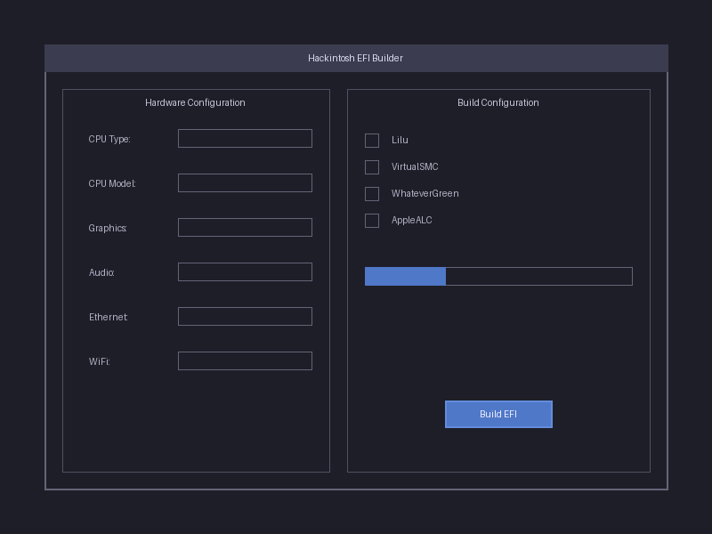

# Hackintosh EFI Builder

A modern, Python-based Automated Hackintosh EFI builder application for Windows with a futuristic UI. This tool simplifies the process of creating custom EFI folders for Hackintosh installations.



## Features

- Modern, futuristic user interface built with CustomTkinter
- Hardware configuration selection (CPU, GPU, Audio, Ethernet, WiFi)
- Automatic kext selection and installation
- OpenCore bootloader integration
- Custom EFI folder generation
- Progress tracking with visual feedback
- Support for multiple hardware configurations

## Requirements

- Python 3.8 or higher
- Windows 10/11 (may work on other platforms but designed for Windows)
- Internet connection for downloading additional resources (if needed)

## Installation

1. Clone this repository or download the ZIP file
2. Install the required dependencies:

```bash
pip install -r requirements.txt
```

## Usage

1. Run the application:

```bash
python main.py
```

2. Configure your hardware settings:
   - Select your CPU type and model
   - Choose your graphics card
   - Select audio, ethernet, and WiFi options
   - Choose which kexts to include

3. Set the output directory for your EFI folder

4. Click "Build EFI" to generate your custom EFI folder

5. Once complete, copy the generated EFI folder to your bootable USB drive or EFI partition

## Included Kexts

The application includes the following kexts:

- Lilu
- VirtualSMC
- WhateverGreen
- AppleALC
- IntelMausi
- USBInjectAll
- CPUFriend
- RestrictEvents

## Disclaimer

This tool is provided for educational purposes only. Hackintosh installations may violate Apple's End User License Agreement (EULA). Use at your own risk.

## License

MIT License